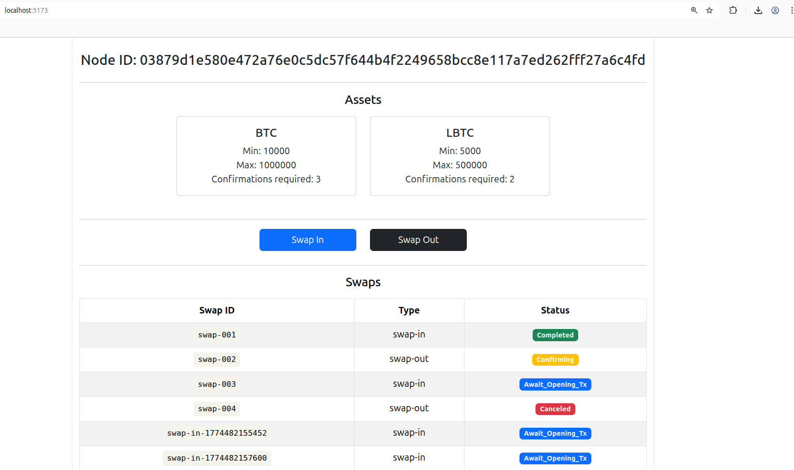

# PeerSwapSDK + React Testing Dashboard

A React + TypeScript frontend for interacting with the [PeerSwap](https://github.com/ElementsProject/peerswap) protocol, built on top of an auto-generated TypeScript SDK from the PeerSwap OpenAPI spec.

> **Note:** This is a demo project for SDK testing purposes only.

---

## Prerequisites

- Node.js 24+
- npm 9+
- [openapi-generator-cli](https://openapi-generator.tech/docs/installation)

---

## Generating the SDK

The TypeScript SDK is generated from the PeerSwap OpenAPI/Swagger spec using `openapi-generator-cli`.

```bash
cd ~
openapi-generator-cli generate \
  -i peerswap-open-api.json \
  -g typescript-fetch \
  -o ./peerswap-sdk/typescript \
  --additional-properties=npmName=peerswap-sdk,npmVersion=1.0.0,supportsES6=true

cd ~/peerswap-sdk/typescript
npm install
npm run build
```

---

## Running the React App with Dummy PeerSwap Server

```bash
cd ~/peerswap-sdk-test
# npm also installs ../peerswap-sdk/typescript and express & cors for dummy server
npm install
# Run dummy server in terminal 1
node server.js
# Run the application in terminal 2
npm run dev
```

Runs at `http://localhost:5173`.


